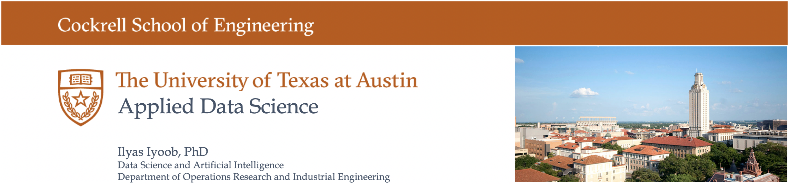

This University of Texas course teaches Generative AI through Experiential Learning.  Students work with GPT from day one and progressively gain Prompt Engineering and Auto Gen skills as they learn from their mistakes.

## About the course

This course delves into the dynamic world of Generative AI, emphasizing the transformative power of Prompt Engineering and AutoGen. Students will explore the art of crafting precise prompts to optimize AI outputs, enhancing clarity and relevance in generated content. Key skills include understanding the principles of prompt design, experimenting with various prompting techniques, and leveraging automation tools to streamline content creation processes. The course will culminate in a capstone project where students showcase their ability to integrate Prompt Engineering and AutoGen techniques to solve real-world problems using Generative AI.

## About the instructor

Dr. Ilyas Iyoob is faculty of Data Science and Artificial Intelligence in the Cockrell School of Engineering at the University of Texas.  He pioneered the seamless interaction between machine learning and operations research in the fields of autonomous computing, health-tech, and fin-tech.  Previously, Dr. Iyoob helped build a cloud computing AI startup and successfully sold it to IBM in 2016.  He currently advises over a dozen venture funded companies and serves as the Global Head of Research at Kyndryl (IBM Spinoff).  He has earned a number of patents and industry recognition for applied Artificial Intelligence and was awarded the prestigious World Mechanics prize by the University of London.

